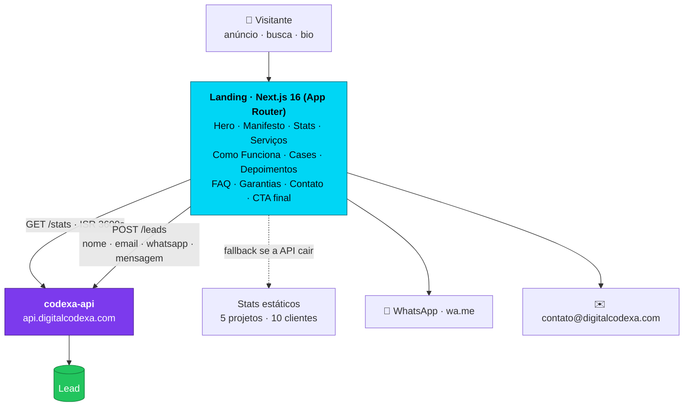

<div align="center">

<h1>🛰️ Codexa — Landing</h1>

<p><strong>A peça de aquisição da Codexa: transforma visitante em briefing qualificado</strong></p>

<p>
  <a href="https://digitalcodexa.com" target="_blank">
    
  </a>
</p>

<p>
  
  
  
  
  
  
  
</p>

</div>

---

## O que é

A Codexa vende software sob medida — sites, sistemas web, apps e automações com IA — para empresas em Lavras/MG e no resto do Brasil. Esta landing é o topo desse funil: é a página para onde vai todo anúncio, cartão e link de bio, e o trabalho dela é um só — **fazer um desconhecido virar um lead com nome, e-mail e uma frase sobre o projeto**. Tudo na página existe para sustentar essa conversão: quem somos, o que entregamos, o que já foi para produção, quanto tempo demora, o que está escrito no contrato e o que acontece se não fechar.

O visitante é um dono de negócio que já foi queimado por agência — por isso a página responde as objeções na ordem em que elas aparecem: prova (**5 cases reais, cada um com link para o produto no ar**), processo (**5 etapas do briefing ao deploy**), garantias (**resposta em 24h, proposta sem compromisso, contrato transparente**) e **8 perguntas no FAQ**. A conversão tem dois caminhos deliberados: WhatsApp para quem quer falar agora, formulário para quem quer escrever e sumir.

Não há backend aqui. A landing é uma casca de aquisição que fala com a **codexa-api** em dois momentos: lê os números da empresa na revalidação e entrega o lead no submit.



O caminho do lead é curto de propósito: `CtaFinal` valida nome e e-mail no cliente, dá `POST` em `/leads` e troca o formulário por uma confirmação. Se a requisição falhar, o erro não é um beco sem saída — a mensagem manda o visitante para o e-mail direto, e o botão de WhatsApp continua flutuando na tela. **Nenhum lead morre por causa de um 500.**

---

## ✨ Destaques de engenharia

**A landing não cai quando a API cai.** Os números da seção Stats vêm de `GET /stats` num Server Component, com `revalidate: 3600` — a página é estática e revalida de hora em hora, sem custo por visita. E o `fetch` está dentro de um `try/catch` que devolve `{ projetos_concluidos: 5, clientes: 10 }` se a API não responder ou retornar erro. A API pode estar fora do ar que a landing continua servindo e continua vendendo. Uma página de aquisição que depende de backend para renderizar é uma página que perde lead quando o backend tosse.

**A esfera 3D é cara — então ela sabe a hora de parar.** O `Orb` do Hero é uma esfera de Fibonacci com 180 pontos, linhas entre vizinhos próximos e 4 pulsos viajando pela malha, em Three.js puro. O custo foi contido em quatro frentes: um `IntersectionObserver` corta o `requestAnimationFrame` assim que ela sai da viewport, o `devicePixelRatio` é travado em 2 (retina não vira 3x de fill rate à toa), o cleanup dá `dispose()` em toda geometria, material e textura, e o mesmo orb reaproveitado na Navbar entra por `next/dynamic` com `ssr: false` e placeholder — WebGL não bloqueia o first paint. Nada de `@react-three/fiber`: a cena é pequena demais para pagar o bundle de um reconciliador.

**`prefers-reduced-motion` como regra, não como enfeite.** Sete arquivos consultam a media query, e cada um tem uma resposta específica em vez de um `if` genérico: o `Orb` renderiza **um único frame estático** e nunca inicia o loop; o `BackgroundEffects` não spawna nenhuma partícula; o `CtaFinal` pula o scrub e entrega o texto já legível. Quem pediu menos movimento recebe a página inteira, só parada.

**Lenis onde faz sentido, scroll nativo onde não faz.** O smooth scroll só sobe se `innerWidth >= 1024` **e** o ponteiro não for `coarse` — celular e tablet ficam com o scroll do sistema, que é melhor que qualquer emulação. No desktop, o Lenis é dirigido pelo `gsap.ticker` com `lagSmoothing(0)` e alimenta o `ScrollTrigger.update`: **um único rAF** para o scroll e para as animações, em vez de dois loops brigando por frame. Durante o preloader ele fica em `stop()`, e só solta quando a animação dispara o evento `lenis-start`.

**Cinco temas que atravessam o CSS e o WebGL.** O `ThemeContext` guarda cada acento em três formatos porque cada camada consome um: `--accent` (hex) para o CSS, `--accent-rgb` para compor `rgba()` com alpha nos glows, e `theme.three` (`0xrrggbb`) para o Three.js. Trocar de cor não remonta a cena 3D — um `useEffect` só reescreve o `color` dos materiais e regenera a textura dos pontos. A cena é criada uma vez e vive o resto da sessão.

**SEO que se atualiza sozinho.** `sitemap.ts`, `robots.ts` e o `metadataBase` leem a mesma env var, então preview e produção nunca anunciam a URL errada. O OG image é gerado em código (`opengraph-image.tsx`) — não é PNG no `public/` para alguém esquecer de atualizar. Fecha com JSON-LD `ProfessionalService` (área atendida, serviços, contato) e uma política de privacidade LGPD linkada dentro do próprio formulário. As quatro fontes entram via `next/font/google` com `display: 'swap'`, self-hosted no build: zero request para o Google em runtime, zero layout shift.

---

## 🎬 Seções

Ordem real de renderização em `src/app/page.tsx`, separadas por `SectionDivider`:

<table>
  <thead>
    <tr><th>Seção</th><th>O que faz</th></tr>
  </thead>
  <tbody>
    <tr><td><code>Hero</code></td><td>Headline + a esfera 3D (Three.js) que reage ao mouse e volta a girar sozinha após 2s de ociosidade</td></tr>
    <tr><td><code>Manifesto</code></td><td>Posicionamento da empresa em duas linhas, reveladas por timeline GSAP</td></tr>
    <tr><td><code>PromisesMarquee</code></td><td>Marquee infinito com 10 promessas — sem lock-in, escopo claro, suporte pós-entrega</td></tr>
    <tr><td><code>Stats</code></td><td>4 números com counter animado — projetos e clientes vêm da API; suporte (30d) e resposta (24h) são fixos</td></tr>
    <tr><td><code>Services</code> <sub><code>#servicos</code></sub></td><td>6 frentes: Sites &amp; Landing Pages, Apps Mobile, Sistemas Web, Automações com IA, APIs &amp; Integrações, Infra &amp; Deploy</td></tr>
    <tr><td><code>HowItWorks</code> <sub><code>#como-funciona</code></sub></td><td>As 5 etapas do processo: Briefing → Proposta → Contrato → Sprints → Deploy</td></tr>
    <tr><td><code>Cases</code> <sub><code>#cases</code></sub></td><td>5 projetos entregues com preview via <code>next/image</code>, stack em tags e link para o produto no ar</td></tr>
    <tr><td><code>Testimonials</code> <sub><code>#depoimentos</code></sub></td><td>3 depoimentos de clientes</td></tr>
    <tr><td><code>FAQ</code> <sub><code>#faq</code></sub></td><td>8 perguntas — as objeções de preço, prazo e propriedade do código</td></tr>
    <tr><td><code>Guarantees</code></td><td>3 compromissos: resposta em 24h, proposta sem compromisso, contrato transparente</td></tr>
    <tr><td><code>Contact</code> <sub><code>#contato</code></sub></td><td>Canais diretos — WhatsApp, e-mail e Instagram — com status "disponível para novos projetos"</td></tr>
    <tr><td><code>CtaFinal</code> <sub><code>#form-contato</code></sub></td><td>Headline pinada revelada palavra a palavra no scrub, o formulário de lead e o footer</td></tr>
  </tbody>
</table>

Sobrepostos à página: `Preloader` (segura o Lenis até terminar), `CustomCursor`, `ColorSwitcher` (troca o acento entre 5 cores), `WhatsAppButton` flutuante e `BackgroundEffects` (grid, binários e símbolos em camadas).

---

## 🛠️ Stack

<table>
  <tbody>
    <tr>
      <td><strong>Framework</strong></td>
      <td>   — App Router</td>
    </tr>
    <tr>
      <td><strong>Estilo</strong></td>
      <td> CSS vars por tema · 4 fontes via <code>next/font/google</code></td>
    </tr>
    <tr>
      <td><strong>Animação</strong></td>
      <td>   — <code>pin</code> + <code>scrub</code></td>
    </tr>
    <tr>
      <td><strong>Scroll</strong></td>
      <td> — só desktop com ponteiro fino, dirigido pelo <code>gsap.ticker</code></td>
    </tr>
    <tr>
      <td><strong>3D</strong></td>
      <td> — WebGL puro, sem react-three-fiber</td>
    </tr>
    <tr>
      <td><strong>Ícones</strong></td>
      <td> + SVG inline</td>
    </tr>
    <tr>
      <td><strong>SEO</strong></td>
      <td>Metadata API · <code>sitemap.ts</code> · <code>robots.ts</code> · OG image dinâmica · JSON-LD <code>ProfessionalService</code></td>
    </tr>
    <tr>
      <td><strong>Observabilidade</strong></td>
      <td> </td>
    </tr>
    <tr>
      <td><strong>Qualidade</strong></td>
      <td> <code>eslint-config-next</code></td>
    </tr>
    <tr>
      <td><strong>Deploy</strong></td>
      <td> — auto-deploy a cada push em <code>main</code> → <a href="https://digitalcodexa.com">digitalcodexa.com</a></td>
    </tr>
  </tbody>
</table>

---

## 🚀 Rodando localmente

### 1. Pré-requisitos

| | Versão | Por quê |
|---|---|---|
| **Node.js** | **>= 20.9.0** | exigido pelo `engines` do Next 16.2.6 |
| **npm** | a que vem com o Node | o repo versiona `package-lock.json` |

Não precisa de banco, Docker, nem conta em serviço externo. **A landing sobe sozinha.**

```bash
node -v   # precisa ser >= v20.9.0
```

### 2. Passo a passo

```bash
# 1. clone
git clone https://github.com/mateus-vitor-ferreira-dev/codexa-landing.git
cd codexa-landing

# 2. dependências (ci respeita o lock; install pode subir versão)
npm ci

# 3. suba o dev server — não precisa de .env para funcionar
npm run dev
```

Pronto: **http://localhost:3000**.

### 3. Variáveis de ambiente

**As duas são opcionais** — toda leitura no código tem `??` com default, então sem `.env` a landing sobe e aponta para a produção. Crie um `.env.local` só se quiser mudar isso:

```ini
# URL pública do próprio site.
# Alimenta metadataBase (layout.tsx), sitemap.ts e robots.ts.
# OPCIONAL — default: https://digitalcodexa.com
# Em dev, defina para o sitemap/robots/OG não anunciarem o domínio de produção.
NEXT_PUBLIC_SITE_URL=http://localhost:3000

# Base da codexa-api. Origem do GET /stats e destino do POST /leads.
# OPCIONAL — default: https://api.digitalcodexa.com
# ⚠️ Sem esta variável, o formulário local grava lead REAL na API de produção.
#    Aponte para a codexa-api rodando na sua máquina antes de testar o form.
NEXT_PUBLIC_API_URL=http://localhost:3001
```

> Variáveis `NEXT_PUBLIC_*` são inlinadas **no build** — mudou o `.env.local`, reinicie o `npm run dev`. Reload no browser não pega.

> `.env*` está no `.gitignore`. Nunca commite — a configuração de produção vive só na Vercel.

### 4. Onde bater para conferir

| Rota | URL | O que prova |
|---|---|---|
| Home | `http://localhost:3000` | preloader roda, esfera 3D gira no Hero |
| Privacidade | `http://localhost:3000/privacidade` | página LGPD linkada no form |
| Sitemap | `http://localhost:3000/sitemap.xml` | gerado por `sitemap.ts`, com a `NEXT_PUBLIC_SITE_URL` ativa |
| Robots | `http://localhost:3000/robots.txt` | gerado por `robots.ts` |
| OG image | `http://localhost:3000/opengraph-image` | renderizada em código, não é arquivo estático |

**Subiu de verdade quando:** a esfera do Hero responde ao mouse e a seção Stats mostra números. Se aparecer **5 projetos / 10 clientes**, o fallback entrou — a API não respondeu, que é o esperado sem a `codexa-api` no ar.

### 5. Problemas comuns

| Sintoma | Causa | Saída |
|---|---|---|
| Stats mostram sempre `5` e `10` | `GET /stats` falhou e o `catch` devolveu o fallback | esperado sem a `codexa-api`; suba ela e ajuste `NEXT_PUBLIC_API_URL` |
| Enviou o form e o lead caiu em produção | sem `NEXT_PUBLIC_API_URL`, o `POST /leads` vai para `api.digitalcodexa.com` | defina a env var **antes** de testar o formulário |
| Mudou o `.env.local` e nada mudou | `NEXT_PUBLIC_*` é inlinado no build | mate o processo e rode `npm run dev` de novo |
| Scroll suave não funciona | é intencional | o Lenis só sobe com viewport >= 1024px e ponteiro fino; abaixo disso é scroll nativo |
| Página estática, sem animação | `prefers-reduced-motion: reduce` ligado no SO | é o comportamento correto |
| Stats não atualizam após mudar na API | `revalidate: 3600` — a página fica cacheada por 1h | `rm -rf .next` e suba de novo |
| Porta 3000 ocupada | outro processo | `npm run dev -- -p 3001` |

### 6. Scripts

| Script | O que faz |
|---|---|
| `npm run dev` | dev server em `http://localhost:3000` |
| `npm run build` | build de produção |
| `npm run start` | serve o build (rode `build` antes) |
| `npm run lint` | ESLint com `eslint-config-next` |

---

<div align="center">
  <sub>
    Feito pela <strong>Codexa</strong> · <a href="https://digitalcodexa.com">digitalcodexa.com</a> · <a href="https://app.digitalcodexa.com">portal</a>
  </sub>
</div>
